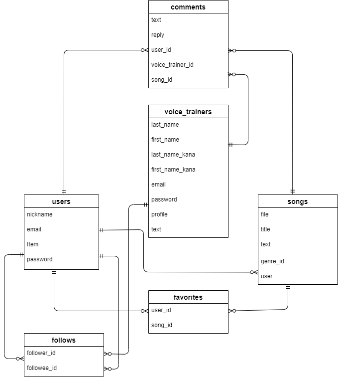

# アプリケーション名

Chanson

# アプリケーション概要

歌をシェアしてユーザー同士でコミュニケーションをとったり、ボイストレーナーからアドバイスをもらうことができる。

# URL

# テスト用アカウント

・Basic認証ID：eowyn 

・Basic認証パスワード：1954

# 利用方法

## 一般ユーザーの場合

1.トップページヘッダーの登録ボタンから新規会員登録する

2.ヘッダーの投稿ボタンから音声ファイル、歌のタイトル、歌のジャンル、一言コメントなどを入力し、投稿する

3.他のユーザーの投稿を再生し、投稿に対してお気に入り登録やコメントを入力したり、投稿者のフォローなどをする

4.気に入ったボイストレーナーがいれば、フォローをする

## ボイストレーナーの場合

1.トップページヘッダーのボイストレーナーのかたはこちらボタンから新規会員登録する

2.一般ユーザーの投稿を再生して、投稿に対してコメント欄からアドバイスを入力する

# アプリケーションを作成した背景

私のように、マンツーマンのボイストレーニングは金銭的にも時間的にも難しいが、歌が上手くなりたくてプロのボイストレーナーのアドバイスは欲しいという人は沢山いるということを知った。また、私が過去に通っていたボイストレーニングスタジオでは、駆け出しのボイストレーナーが、生徒がなかなかつかずトレーナーとしての経験が積めないという問題を抱えていた。そこで、そのような歌い手とボイストレーナーの出会いの場を提供したいと思った。無料で歌を投稿できるアプリなら多くの人が気軽に利用することができ、歌い手はより多くのユーザーやボイストレーナーからのアドバイスが貰えるし、ボイストレーナーも歌が上手くなりたい多くのユーザーとの出会いが叶うと考えた。

# 洗い出した要件
[要件定義シート](https://docs.google.com/spreadsheets/d/1Mcw-2VIBz3ClBwKlZW21OzpEmD_UJq175lRiY9vvZbU/edit#gid=982722306) 

# 実装した機能についての画像やGIFおよびその説明

# 実装予定の機能

# データベース設計

# 画面遷移図

# 開発環境
・フロントエンド　HTML,CSS,JavaScript

・バックエンド　Ruby,Ruby on rails

・テキストエディタ　VS code

・タスク管理　GitHub

# ローカルでの操作方法

# 工夫したポイント

# 改善点

# 制作期間

